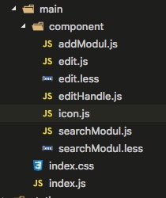

## uba环境搭建

### node安装：

### 安装 node 环境来处理react项目的包管理
- `node.js` 软件版本需要大于`6.x`以上即可
- `npm`建议大于`3.x`以上即可。

### 安装node地址  

[node下载地址](http://www.nodejs.org/download/)


### 安装node教程
选择电脑系统对应的版本下载即可，下载完成安装nodejs，安装过程基本直接“NEXT”就可以了。（windows的安装msi文件在过程中会直接添加path的系统变量，变量值是你的安装路径，例如“C:\Program Files\nodejs”）。
### 检测node安装是否成功
安装完成后可以使用cmd（win+r然后输入cmd进入）测试下是否安装成功。方法：在cmd下输入node -v，出现下图版本提示就是完成了NodeJS的安装。

（mac安装完成查看版本）


（windows安装完成查看版本）
### npm介绍
npm的安装。由于新版的NodeJS已经集成了npm，所以之前npm也一并安装好了。同样可以使用cmd命令行输入"npm -v"来测试是否成功安装。如下图，出现版本提示便OK了。
### 安装完成
常规NodeJS的搭建到现在为止已经完成了，急不及待的话你可以在”cmd“输入”node“进入node开发模式下，输入你的NodeJS第一句：”hello world“ - 输入：console.log('hello world')。
### window版本配置环境变量
npm作为一个NodeJS的模块管理，之前我由于没有系统地看资料所以导致安装配置模块的时候走了一大段弯路，所以现在很有必要列出来记录下。(windows配置一下)

①、我们要先配置npm的全局模块的存放路径以及cache的路径，例如我希望将以上两个文件夹放在NodeJS的主目录下，便在NodeJs下建立"node_global"及"node_cache"两个文件夹。如下图

②、启动cmd，输入

```
npm config set prefix "C:\Program Files\nodejs\node_global"
以及
npm config set cache "C:\Program Files\nodejs\node_cache"
```

③、现在我们来装个模块试试，选择express这个比较常用的模块。同样在cmd命令行里面，输入“npm install express -g”（“-g”这个参数意思是装到global目录下，也就是上面说设置的“C:\Program Files\nodejs\node_global”里面。）。待cmd里面的安装过程滚动完成后，会提示“express”装在了哪、版本还有它的目录结构是怎样。如下图

④、关闭cmd，打开系统对话框，“我的电脑”右键“属性”-“高级系统设置”-“高级”-“环境变量”。如下图


⑤、进入环境变量对话框，在系统变量下新建"NODE_PATH"，输入”C:\Program Files\nodejs\node_global\node_modules“。（ps：这一步相当关键。）

2014.4.19新增：由于改变了module的默认地址，所以上面的用户变量都要跟着改变一下（用户变量"PATH"修改为“C:\Program Files\nodejs\node_global\”），要不使用module的时候会导致输入命令出现“xxx不是内部或外部命令，也不是可运行的程序或批处理文件”这个错误。

⑥、以上步骤都OK的话，我们可以再次开启cmd命令行，进入node，输入“require('express')”来测试下node的模块全局路径是否配置正确了。正确的话cmd会列出express的相关信息。如下图（如出错一般都是NODE_PATH的配置不对，可以检查下第④⑤步）

### uba初始化工程
#### 1、基于node安装完成后，来安装 用友React项目初始化工具  uba;
[uba 教程](http://docs.tinper.org/uba/)

外网情况下使用`npm`安装全局使用

```bash
$ npm install uba -g      #全局安装uba
```
公司内网下使用ynpm来安装

```bash
$ npm install ynpm-tool -g  #安装集团内网ynpm到全局
$ ynpm install uba -g       #安装uba全局，后面下载npm包慢也可以使用ynpm install来安装依赖包
```
#### 2、安装完成后查看 uba 版本

检测uba是否安装成功

```
uba -v
```


#### 3、安装完 脚手架工具uba 之后  初始化项目

```
uba init
```


uba init 回车出现上图，我们根据需求 选择对应 脚手架。包括 单页应用、多页应用等。

#### 4、今天我们以React多页应用脚手架为力来实现 币种案例。选择React 多页应用脚手架 回车，初始化项目文件目录以及基本文件。为项目命名如下图。


#### 5、是否初始化node_modules,此处选择y；回车。开始加载


#### 6、项目文件以及文件夹说明：

项目初始化成功后查看目录文件。


此项目中：

```
 mock 文件夹📂存放本地模拟请求数据文件，node_modules存放项目所用包数据文件，
```

```
package.json文件📃写入该项目使用的包名以及启动、构建、等命令（可以自行配置）。
在前端工程中，安装插件或库：

添加 package到： dependencies
npm install <package-name> --save 或
npm install <package-name>

添加 package到： devDependencies
npm install <package-name> --save-dev

区别在于：
dependencies中的依赖项是正常运行该包所需要的依赖项；
devDependencies中的依赖项是开发的时候所需要的依赖项，比如一些进行单元测试之类的包；
dependencies中，是生产环境所需要的库；
devDependencies中，放的是你开发时候用到的库，比如测试库等等，在生产环境中是不需要的；
那什么是开发环境，什么是生产环境呢？
下面一张图告诉你：
```


```
README.md文件📃存放项目说明以便于团队开发保持项目的统一性和易管理性。
```

```
src文件夹用于存放项目的js文件和组件以及css，图片，font字体等
其中 assets 文件夹📂用于存放 images(就是图片文件夹)；
components文件夹📂用于存放 公用组件；
pages文件夹📂用于存放 页面逻辑js以及页面元素编写逻辑。
前端开发人员需要配合后端人员完成项目的页面编写接口数据处理，以及数据缺失补充和友好页面提示防止页面出现不必要的错误提示。
```

```
uba.config.js文件📃是项目重要配置文件包括端口号配置，代理模式切换，公用变量配置，入口文件配置，以及文件解析**-loader的预设置。
```

```
uba.mock.js文件📃是uba模拟本地数据请求配置文件，文件指定GET方式请求本地数据路径，POST方式请求本地数据路径等配置。
```

#### 7、启动项目

初始化完成。cd 到目录。使用 uba server命令来启动项目。


###概述

### 初心

我们为什么要做这个整体解决方案。

第一点，现在前端生态很好，各种框架和类库层出不穷，质量和易用性也是参差不齐。对于每一个项目，复杂的前端选型过程带给我们沉重的负担。

第二点，当我们好不容易做好了技术选型，又要花很多时间来拼凑他们，并且需要沉淀很长时间，踩很多的坑，来得到一个比较好的实践。

第三点，现在前端工程日益复杂，目前主流的方案，都需要依赖于webpack或是其他工具来辅助开发。配置开发工程已经很需要耗时耗力了，
在上线时，还需要更深入的了解这些工具，来优化我们的工具配置和代码。

这些内容都耗费了我们大量的心力和时间。所以这里将我们在项目中的最佳实践，分享出来，做一个整体技术方案，介绍给大家。

### 整体介绍

tinper-react是基于react库及周边技术搭建的整体复杂应用解决方案。集成了react，redux，axios，react-router，webpack等开源技术。
并根据大量项目的实践，得出的一套最佳解决方案。帮助开发者快速搭建前端项目，又快又好地开发前端业务。

首先是开发工具，webpack是一个很好很强大的工具，我们根据项目中的应用，加装了一些配置。封装成uba开发工具，帮助开发者快速生成项目，
无忧开发，调试，打包及优化。然后是UI层，我们封装了很多的UI组件库tinper-bee，方便快速开发页面。对于复杂应用，我们使用了mirror这个
开源的数据管理框架，将复杂的数据管理，路由操作，通过简单的api和使用方式提供给开发者，让开发者清晰简单的完成复杂应用的开发和管理。

tinper-react的整体技术方案，包含了：

- [uba开发工具](https://github.com/iuap-design/tinper-uba)
- [tinper-beeUI组件库](http://bee.tinper.org/)
- [mirror数据管理框架](https://github.com/mirrorjs/mirror)

**uba**

`uba`采用微内核、多插件开发，它基于 `webpack` 封装的 `cli` 命令行工具，为了解决目前前端快速开发不足而打造，
提供一站式项目脚手架、最佳实践初始化、本地服务调试、数据模拟、远程代理、资源编译、静态产出、性能优化等功能。
`uba`是一个前端开发工具，可以提供多种开发场景。 核心开发人员会在远端最佳实践仓库
[uba-templates](https://github.com/uba-templates) 进行更新和维护，当然也可以根据所需的样式和功能提供不同的模板。
可以给使用开发者提供轻量、简单、便捷的开发体验，让开发者从复杂的配置中脱离出来，这些复杂而又不易初学者学习的内容，
就交给我`uba`来解决吧！

**tinper-bee**

tinper-bee 是基于 iuap design设计规范封装的 react 组件库，包含丰富的基础组件和应用组件，
支持组件的灵活调用和扩展，助力快速进行应用的组件化开发。并且我们提供适用于企业级应用的表单，
表格和grid组件，满足您大量数据的处理操作展示和复杂交互需求。

**mirror**

Mirror是基于redux的react数据管理框架，用极少数的 API 封装所有繁琐甚至重复的工作，
提供一种简洁高效的更高级抽象，同时保持原有的开发模式。

### 学习指导

使用这套解决方案，你需要有一些基本的知识储备：

- [react](https://discountry.github.io/react/)
- [react-router v4](http://reacttraining.cn/web/guides/quick-start)
- [axios](https://github.com/mzabriskie/axios)

## 基于Tinper-bee中的table组件和其他组件 来实现币种表案例

### 目录结构

1、上一章我们讲解了使用uba来搭建一个项目，正如大家所看到的 使用uba 搭建一个项目是如此简单，搭建出项目环境只是我们项目的第一步，这一章我们来讲一下利用tinper-bee组件来实现一个currencv table （币种表），通过这个表我们能够初步了解 利用React、es6 编写项目配合tinper-bee组件迅速实现美观大方的页面是非常愉快的一件事。什么是tinper-bee呢？简单说一下 [tinper-bee](http://bee.tinper.org/) tinper-bee 是基于 iuap design 的 react 组件库，包含丰富的基础组件和应用组件，支持组件的灵活调用和扩展，助力快速进行应用的组件化开发。React 是一个采用声明式，高效而且灵活的用来构建用户界面的框架。[react开发中文版教程网址](https://doc.react-china.org/tutorial/tutorial.html)  

#### 丰富的基础组件

包含大量简单易用的基础组件，支持快速搭建页面和构建您的个人应用。

#### 企业级特性组件

提供适用于企业级应用的表单，表格和grid组件，满足您大量数据处理操作展示和复杂交互需求。

#### 支持强大的组件扩展和自定义

每个组件提供了丰富的API接口和充分自由度给用户来定义自己的组件，实现用户想要的效果和特性。

上面tinper-bee网址中有更多更详细的tinder-bee的介绍，在此我们不做过多的介绍，开始来说一下我们构建币种项目的目录结构；

2、首先看一下项目实现效果：


币种表单简单的实现了数据展示，数据编辑，数据添加，数据删除功能。


3、如图所示，assets文件存📂放 images文件夹📂，components文件夹📂存放公用组件，pages 文件夹📂存放页面文件，pages分为 app、currency、default、index文件夹；

### 文件讲解

1、首先我们从index文件夹开始说起，正如大家所了解的，这个项目为多页项目，所以我们这个项目分为多个页面，每个页面分为一个文件夹📂，方便管理的规则，目录清晰。index文件夹内分文，index.js,index.css,index.html;此处在uba.donfig.js内配置，页面入口。

```
//dev多入口配置
glob.sync("./src/pages/*/index.js").forEach(path => {
  const chunk = path.split("./src/pages/")[1].split("/index.js")[0];
  entries[chunk] = [path, hotMiddlewareScript];
  chunks.push(chunk);
});
```

2、我们首先看 index文件夹中的index.html

```
<!DOCTYPE html>
<html lang="zh-CN">
<head>
  <meta charset="UTF-8">
  <meta name="viewport" content="width=device-width, initial-scale=1.0">
  <meta http-equiv="X-UA-Compatible" content="ie=edge">
  <title>Index</title>
    <link rel="stylesheet" href="//design.yonyoucloud.com/static/tinper-bee/0.6.2/assets/tinper-bee.min.css">
</head>
<body>
  <div id="app"></div>
  <script src="//design.yonyoucloud.com/static/babel-polyfill/6.26.0/polyfill.min.js"></script>
  <script src="//design.yonyoucloud.com/static/react/15.6.1/react.min.js"></script>
  <script src="//design.yonyoucloud.com/static/react/15.6.1/react-dom.min.js"></script>
   <script src="//design.yonyoucloud.com/static/tinper-bee/0.6.2/build/tinper-bee.js"></script>
</body>
</html>
```

通过上面的代码可以看出，首先我们引入了tinper-bee.min.css 地址为线上地址，此处较大的文件 引入线上地址来减少打包后的项目体积。此处script 引入了，polyfill.min.js 处理IE低版本浏览器不兼容问题，和react核心代码react.min.js 和react-dom.min.js 和我们组件库核心代码 tinper-bee.js;很显眼的一个div id=‘app’的元素用于存放我们逻辑处理后的元素。相当于一个容器便于页面切换和元素变换。


3、我们又看一下index文件夹中的index.js

```
//引入react核心代码定义变量为React；
import React from 'react';
//引入react 渲染代码 定义为ReactDOM;
import ReactDOM from 'react-dom';
//引入项目的核心代码 路由入口代码；
import App from '../app/index'
//引入 mirrorx 阿里封装的redux代码；
import mirror, { Router, Route, render ,hashHistory} from 'mirrorx';
//引入 css文件；来修饰 页面元素样式；
import './index.css';
//此处获取页面app元素，来存放我们页面的输出页面；
const content = document.querySelector("#app");
//此处定义 mirror的配置路由模式为hash；
mirror.defaults({
    historyMode: 'hash'
});
//使用mirrorx中的render方法来渲染页面。
render(<Router><App /></Router>, content);
```

通过上面代码来看index.js是核心代码，引入需要的代码，渲染页面。

4、我们再看一下index.css ，或者index.less;

```
.Test{
  color : "green";
  background: url("../../assets/images/jay.jpg") no-repeat center center;
}
.uf{
  font-size: 16px;
}
.u-breadcrumb{
  margin: 0;
  margin-bottom: 20px;
}
```

此处代码就是定义元素的显示方式，以及背景图片，字体大小等。

5、app文件夹代码解析。

app文件夹📂中的index.js

```
//引入react核心代码；
import React, { Component } from 'react';
//引入mirrorx中的路由；
import { Router, Route } from 'mirrorx';
//引入classnames 来处理 元素样式的逻辑判断。下面会单独说classnames的用法。
import classnames from 'classnames';
//重点来了，此处引入 tinper-bee的组件 Icon和Con两个组件。
import { Icon, Con } from 'tinper-bee';
// 引入组件来实现路由切换;
import Def from '../default/index';
import Main from '../main/index';
import AddList from '../currency/index';
import Menus from 'components/Menus/index';
import MyHeader from 'components/MyHeader/index';
//引入样式;
import './index.css';
//定义 App组件
export default class App extends Component {
    constructor(props) {
    //此处是props集成字Component
        super(props);
        //该组件的状态，通过状态来控制页面逻辑、数据等。
        this.state = {
            toggle: false
        }
    }
    // 展开收起菜单(定义事件操作元素)
    handleToggle = () => {
        this.setState({
            toggle: !this.state.toggle
        })
    }
    //页面渲染
    render() {
    //定义变量 使用es6结构方法获取变量，此处有ES6的语法讲解的详情文档就会一目了然。
        const { toggle } = this.state;
        return (
        	//此处为 元素行内样式写法，但不建议如此写法，最好用className来修饰元素，页面不会乱，方便管理；
            <div style={{ height: '100%' }}>
            	//react 的class写法是className 为了避免 定义class的语法冲突，所以css 的class必须使用className来修饰元素，classnamse组件来实现样式逻辑。
                <div className={classnames("side-bar", { "toggled": toggle })}>
                	//下面代码为是根据toggle的状态来控制 显示Icon图标还是img图片标签；
                    {
                        toggle ? (
                            <Icon type="uf-iuap-col" className="nav-icon" />
                        ) : ()
                    }
                    //此处引入公用Menus组件；
                    <Menus toggle={toggle} />
                </div>
                <div className={classnames("content", { "toggled": toggle })}>
                    <MyHeader toggle={toggle} onToggle={this.handleToggle} />
                    <Con fluid={true}>
                        <Route exact path="/" component={Def} />
                        <Route path="/AddList" component={AddList} />
                        <Route path="/Mains" component={Main} />
                    </Con>
                </div>
            </div>
        )
    }
}
```

上面代码有点多，我们一步一步解析，另外也可以参考代码内注释，方便理解。代码分为两部分，上半部分为引入部分，来引用我们公用的组件公用的库，公用的样式等文件，此处不做过多的解释，下半部分为定义默认组件并且输出去。

```
export default class App extends Component //定义并输出组件，export 输出 defualt 默认 class 组件 为App名字的组件。
```

此处代码是定义组件继承和定义状态

```
 constructor(props) {
    //此处是props集成字Component
        super(props);
        //该组件的状态，通过状态来控制页面逻辑、数据等。
        this.state = {
            toggle: false
        }
    }
```

此处代码是定义事件方法并且修改组件状态来达到与页面互动的效果

```
 // 展开收起菜单(定义事件操作元素)
    handleToggle = () => {
    	//在组件内this 代表组件本身，this.state 可以直接获取组件状态  this.setState 方法来改变 组件的state状态。
        this.setState({
            toggle: !this.state.toggle
        })
    }
```

render方法的使用

```
 //页面渲染
    render() {
    //定义变量 使用es6结构方法获取变量，此处有ES6的语法讲解的详情文档就会一目了然。
        const { toggle } = this.state;
        return出去在react 16版本之前只允许 输出一个元素就是顶级元素多了就会报错，16版本之后就可以return 数组如：return [
         	<div>222</div>,
        	<div>222</div>,
    	]；
    	可以return 字符串 如： return '我是一个静态字符串，我负责渲染名字'等。
        return (<div>我是输出的元素</div>)
        }
```

6、下面我们介绍币种组件代码；currency组件；

先看index.js 代码

```
/**引入核心代码 css样式**/
import React, { Component } from 'react';
import { Link } from 'mirrorx';
import { Row, Col, Panel, Table, Select, Button, Modal, Form, FormControl, FormGroup, InputGroup, Icon, Input, Popconfirm, Animate, ControlLabel } from 'tinper-bee';
import './index.css';
```

定义组件

```
class AddList extends Component 
```

定义组件状态 以及表格所用数据；因为是前端代码，目前数据模拟为本地数据，后续会单独说对接后台请求数据；

```
constructor(props) {
        super(props);
        // 定义表格表头
        this.columns = [
            { title: "币种", dataIndex: "name", key: "name", width: "30%" },
            { title: "编码", dataIndex: "code", key: "code" },
            { title: "精度", dataIndex: "currdigit", key: "currdigit" },
            { title: "状态", dataIndex: "enablestatus", key: "enablestatus" },
            {
                title: "删除", dataIndex: "operation", key: "operation",
                render: (text, record, index) => {
                    return (
                        <Popconfirm content="确认删除?" id="aa" onClose={this.onDelete(index)}>
                            <Icon type="uf-del" />
                        </Popconfirm>
                    );
                }
            }
        ];
        this.state = {
            dataSource: [
                { key: "0", name: "沉鱼", code: "1", currdigit: "18", pk_currtype: false, enablestatus: "96, 77, 89", },
                { key: "1", name: "落雁", code: "2", currdigit: "18", pk_currtype: false, enablestatus: "96, 77, 89", },
                { key: "2", name: "闭月", code: "3", currdigit: "18", pk_currtype: false, enablestatus: "96, 77, 89", },
                { key: "3", name: "羞花", code: "4", currdigit: "18", pk_currtype: false, enablestatus: "96, 77, 89", },
            ],
            count: 1,
            showModal: false,
            refCbData: [],
            addOrChange: false,
            changeIndex: '',
            name: "",
            code: "",
            currdigit: "",
            enablestatus: "1",
            pk_currtype: false,
            dataLink: [],

        };
        self = this;
    }
```

初始化数据此处有一个生疏的单词就是 componentDidMount方法，这就涉及到[react 组件的生命周期](http://www.runoob.com/react/react-component-life-cycle.html) ，生命周期包括：

当组件在**客户端**被实例化，第一次被创建时，以下方法依次被调用：

1、getDefaultProps
2、getInitialState
3、componentWillMount
4、render
5、componentDidMount

当组件在**服务端**被实例化，首次被创建时，以下方法依次被调用：

1、getDefaultProps
2、getInitialState
3、componentWillMount
4、render

```
componentDidMount() {
        this.initData();
    }
    // 初始化数据
    initData = () => {
        // axios({
        //     method: 'get',
        //     // http://10.11.65.50:9999/appdemo/train_currtype/list
        //     // https://api.douban.com/v2/book/search?q=javascript&count=1
        //     url: 'http://api.douban.com/v2/book/search?q=javascript&count=1    ',
        // }).then(function (res) {
        //     console.log(res);
        // });

    }
```

代码中间部分为组件的方法部分即是逻辑处理部分

```
 //点击行执行方法
 onCellChange = (index, key) => {
        return value => {
            const dataSource = [...this.state.dataSource];
            dataSource[index][key] = value;
            this.setState({ dataSource });
        };
    };
    // 删除数据执行方法
    onDelete = (index) => {
        return () => {
            const dataSource = [...this.state.dataSource];
            dataSource.splice(index, 1);
            this.setState({ dataSource });
        };
    };
    ...
```

最后即是渲染页面 并输出组件

```
 // 渲染页面
    render() {
        const { dataSource, addOrChange, dataLink } = this.state;
        const columns = this.columns;
        var data = this.state, tac = { 'text-align': 'right' }, mt = { 'margin-top': '10px' }, lmt = { 'margin-top': '18px' }
        return (
            <div>
                <Link to="/">首页</Link>
                 <Link to="/">首页</Link>
                <Modal
                    show={this.state.showModal}
                    onHide={this.close} >
                    <Modal.Header>
                        <Modal.Title>{addOrChange ? '修改' : '添加'}币种信息：</Modal.Title>
                    </Modal.Header>
                    <Row>
                        <Modal.Body ref={(c) => { this.FormData = c }} style={tac} >
                            <Col md={2} xs={2} sm={2} style={lmt}>币种：</Col>
                            <Col md={4} xs={4} sm={4} ><FormControl type="text" onChange={this.valueChange.bind(this, 'name')} value={data.name} style={mt} />
                            </Col>
                            <Col md={2} xs={2} sm={2} style={lmt}>编码：</Col>
                            <Col md={4} xs={4} sm={4} ><FormControl type="text" onChange={this.valueChange.bind(this, 'code')} value={data.code} style={mt} /> </Col>
                            <Col md={2} xs={2} sm={2} style={lmt}>精度：</Col>
                            <Col md={4} xs={4} sm={4} ><FormControl type="text" onChange={this.valueChange.bind(this, 'currdigit')} value={data.currdigit} style={mt} /></Col>

                        </Modal.Body>
                    </Row>
                    <Modal.Footer>
                        <Button onClick={this.close} shape="border" style={{ marginRight: 50 }}>关闭</Button>
                        <Button onClick={this.addMoreList} colors="primary">{addOrChange ? '修改' : '确认'}</Button>
                    </Modal.Footer>
                </Modal>
                <Button
                    className="editable-add-btn"
                    colors="primary"
                    className="a"
                    onClick={this.handleAdd}
                >
                    添加
                </Button>
                <Table
                    bordered
                    data={dataSource}
                    columns={columns}
                    getBodyWrapper={this.getBodyWrapper}
                    onRowClick={this.rowClick}
                />
            </div>)
         }
 //输出组件方便调用
 export default AddList;
```

#### 最后总结

以上代码就是一个简单的币种表格实现方式，由于涉及配置部分请根据项目不同自行配置。

## 主子表代码解析

### 文件目录分析

分析主子表目录结构，根据结构来分析其写法对照币种表，有哪些不同。我们看如下图，在main文件夹📂内有一个文件夹component，前文我们说过，公用组件存放在components文件夹内，而单单独页面使用的组件存放在component文件夹内，如图内所示，component内包括，addModul、edit、editHandle、等组件，这些组件都为主子表页面单独使用，使用组件，易于管理，方便复用。




### 代码查看

看index.js代码

```
import React, { Component } from "react";
import classnames from 'classnames';
import { Table, Pagination } from "tinper-bee";
// 内部组件
import EditModul from "./component/edit";
import Logo from "./component/icon";
import AddModul from "./component/addModul";
import SearchModul from "./component/searchModul";
import EditHandle from "./component/editHandle";
import {Link} from 'mirrorx';
```

上面代码不多说，引入外部组件。

```
const tableColumns = [
    {
        dataIndex: 'description',
        key: 'description',
        title: '备注'
    },
    {
        dataIndex: 'status',
        key: 'status',
        title: '状态'
    },
    // {
    //     dataIndex: 'ipuquotaionid',
    //     key: 'ipuquotaionid',
    //     title: '主键'
    // },
    {
        dataIndex: 'corp_account',
        key: 'corp_account',
        title: '银行账号'
    },
    {
        dataIndex: 'processor',
        key: 'processor',
        title: '录入人'
    },
    {
        dataIndex: 'processtime',
        key: 'processtime',
        title: '订单日期'
    },
    {
        dataIndex: 'currencyid',
        key: 'currencyid',
        title: '币种'
    },
    {
        dataIndex: 'currency_code',
        key: 'currency_code',
        title: '币种编码'
    },
    {
        dataIndex: 'ecbillcode',
        key: 'ecbillcode',
        title: '订单编号'
    },
    {
        dataIndex: 'contact',
        key: 'contact',
        title: '联系人'
    },
    {
        dataIndex: 'phone',
        key: 'phone',
        title: '联系电话'
    }
];
const columnsChild = [
    { title: "备注", dataIndex: "productdesc", key: "productdesc" },
    { title: "产品", dataIndex: "productname", key: "productname" },
    { title: "订单金额", dataIndex: "purchaseamount", key: "purchaseamount" },
    { title: "单位", dataIndex: "unit", key: "unit" }
];
```

定义主表和子表的表头。const 为ES6语法定义常量，不可修改。


定义Main组件

```
export default class Main extends Component 
```

组件内部定义状态

```
 constructor(props) {
        super(props);
        this.state = {
            // 子表数据
            children_data: [],
            // 展开收起
            toggle: false,
            // 当前选中行数
            curIndex: '',
            // 增加数据模块
            isAddData: false,
            // 搜索模块
            isSearch: false,
            // 编辑模块
            isEdit: false,
            //表格数据(此处数据应从后台获取)
            tableData: [
                {
                    'description': '备注1',
                    'status': '启用',
                    'subject': '李小龙',
                    'ipuquotaionid': '主键',
                    'corp_account': '8888 888 8888',
                    'processor': '房帅中',
                    'processtime': '2012-01-09',
                    'currencyid': '真',
                    'currency_code': '001',
                    'ecbillcode': '000021',
                    'contact': '李小龙',
                    'phone': '198888',
                    'key': 0,
                    'children_data': [
                        { ipuquotationdetailid: '1', productdesc: '备注1', productname: '产品1_1', purchaseamount: 1000, unit: '元', quotationid: '1', key: '1' },
                        { ipuquotationdetailid: '2', productdesc: '备注2', productname: '产品1_2', purchaseamount: 1000, unit: '元', quotationid: '2', key: '2' },
                    ]
                },
                {
                    'description': '假装是个备注',
                    'status': '启用',
                    'subject': '甄子丹',
                    'ipuquotaionid': '主键',
                    'corp_account': '8888 888 8888',
                    'processor': '房帅中',
                    'processtime': '2012-01-09',
                    'currencyid': '真',
                    'currency_code': '001',
                    'ecbillcode': '000021',
                    'contact': '甄子丹',
                    'phone': '18701517173',
                    'key': 1,
                    'children_data': [
                        { ipuquotationdetailid: '1', productdesc: '备注2_1', productname: '产品2_1', purchaseamount: 1000, unit: '元', quotationid: '1', key: '1' },
                    ]
                }
            ],
            curKey: 1
        };
    }
```

组件内事件方法代码，通过下面代码可以看出我们的事件，大部分都是在处理Main组件的state即状态，在修改状态的同时处理页面显示，以及数据操作。

```
// 点击菜单展开收起
    handleToggle = () => {
        this.setState({
            toggle: !this.state.toggle
        })
    }
    // 点击行
    rowclick = (record, index, e) => {
        let {tableData} = this.state, child = tableData[index].children_data;
        this.setState({ curIndex: index, children_data: child });
    };
    // 点击增加按钮
    addData = () => {
        this.setState({
            isAddData: true
        })
    }
    // 取消添加
    cancelAdd = () => {
        this.setState({
            isAddData: false
        })
    }
    // 添加数据
    addButton = (obj) => {
        let {tableData, curKey} = this.state;
        console.log(curKey += 1);
        let addData = {
            'description': obj.mName,
            'status': '启用',
            'subject': '甄子丹',
            'ipuquotaionid': '主键',
            'corp_account': '8888 888 8888',
            'processor': '房帅中',
            'processtime': '2012-01-09',
            'currencyid': '真',
            'currency_code': '001',
            'ecbillcode': '000021',
            'contact': obj.mUser,
            'phone': '18701517173',
            'key': curKey,
            'children_data': obj.childData
        }
        tableData.push(addData)
        this.setState({
            tableData, curKey, isAddData: false
        })
    }
    // 删除数据
    deleteData = () => {
        let {curIndex, tableData, children_data} = this.state;
        if (curIndex === '') {
            alert('请选择删除')
        } else {
            tableData.splice(curIndex, 1);
            this.setState({
                tableData, children_data: []
            })
        }
    }
    // 编辑数据
    handleEdit = () => {
        this.setState({
            isEdit: true
        })
    }
    // 取消编辑
    cancelEdit = () => {
        this.setState({
            isEdit: false
        })
    }
    // 冻结数据
    frozen = () => {
        console.log('冻结数据');
        let {curIndex, tableData, children_data} = this.state;
        if (curIndex === '') {
            alert('请选择数据')
        } else {
            tableData[curIndex].status = '停用';
            console.log(tableData[curIndex]);
            this.setState({
                tableData
            })
        }

    }
    cancelFrozen = () => {
        let {curIndex, tableData, children_data} = this.state;
        if (curIndex === '') {
            alert('请选择数据')
        } else {
            tableData[curIndex].status = '启用';
            console.log(tableData[curIndex]);
            this.setState({
                tableData
            })
        }
    }
```


渲染部分代码

```
 render() {
        let sh = { height: '100%' },
            {toggle, isAddData, isSearch, tableData, isEdit} = this.state;
        return (
            <div>
                <Link to="/">首页</Link>
                <EditModul
                    addData={this.addData}
                    deleteData={this.deleteData}
                    handleEdit={this.handleEdit}
                    frozen={this.frozen}
                    cancelFrozen={this.cancelFrozen} />
                <EditHandle
                    isEdit={isEdit}
                    cancelEdit={this.cancelEdit} />
                <AddModul
                    isAddData={isAddData}
                    cancelAdd={this.cancelAdd}
                    addButton={this.addButton} />
                <div>{isAddData ? "" :
                    <div>
                        <SearchModul
                            isSearch={isSearch} />
                        <Table
                            style={{ width: '100%' }}
                            columns={tableColumns}
                            data={tableData}
                            onRowClick={this.rowclick}
                            title={currentData => <div>标题: 我是主表</div>}
                        />
                        <Table
                            style={{ marginTop: 40 }}
                            columns={columnsChild}
                            data={this.state.children_data}
                            title={currentData => <div>标题: 我是子表</div>}
                        />
                    </div>
                }</div>

            </div>
        );
    }
    
```

### 分析子组件

此处我们以简单的编辑组件为例讲解，父组件与子组件传递数据

```
import React, { Component } from 'react';
import { Button } from 'tinper-bee';
//引入edit样式
require('./edit.less');
export default class EditModul extends Component {
    constructor(props) {
        super(props)

    }
    render() {
        return (
            <div className="edit_modul">
            此处通过this.props 来拿到 父组件的方法，当点击子组件的元素时，来执行父组件定义的方法，从而来实现，组件之间的相互传值，调用。
                <Button onClick={this.props.addData}>增加</Button>
                <Button onClick={this.props.deleteData}>删除</Button>
                <Button onClick={this.props.handleEdit}>编辑</Button>
                <Button onClick={this.props.frozen}>冻结</Button>
                <Button onClick={this.props.cancelFrozen}>取消冻结</Button>
            </div>
        )
    }
}
```

