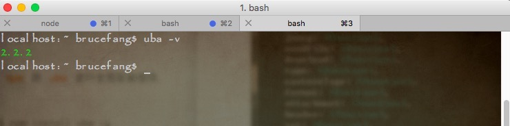

# uba环境搭建

### 第一步：

#### 安装 node 环境来处理react项目的包管理
- `node.js` 软件版本需要大于`6.x`以上即可
- `npm`建议大于`3.x`以上即可。

1、安装node地址  

[node下载地址](http://www.nodejs.org/download/)


2、选择电脑系统对应的版本下载即可，下载完成安装nodejs，安装过程基本直接“NEXT”就可以了。（windows的安装msi文件在过程中会直接添加path的系统变量，变量值是你的安装路径，例如“C:\Program Files\nodejs”）。
3、安装完成后可以使用cmd（win+r然后输入cmd进入）测试下是否安装成功。方法：在cmd下输入node -v，出现下图版本提示就是完成了NodeJS的安装。

（mac安装完成查看版本）


（windows安装完成查看版本）

4、npm的安装。由于新版的NodeJS已经集成了npm，所以之前npm也一并安装好了。同样可以使用cmd命令行输入"npm -v"来测试是否成功安装。如下图，出现版本提示便OK了。

5、常规NodeJS的搭建到现在为止已经完成了，急不及待的话你可以在”cmd“输入”node“进入node开发模式下，输入你的NodeJS第一句：”hello world“ - 输入：console.log('hello world')。

6、npm作为一个NodeJS的模块管理，之前我由于没有系统地看资料所以导致安装配置模块的时候走了一大段弯路，所以现在很有必要列出来记录下。(windows配置一下)

①、我们要先配置npm的全局模块的存放路径以及cache的路径，例如我希望将以上两个文件夹放在NodeJS的主目录下，便在NodeJs下建立"node_global"及"node_cache"两个文件夹。如下图

②、启动cmd，输入

```
npm config set prefix "C:\Program Files\nodejs\node_global"
以及
npm config set cache "C:\Program Files\nodejs\node_cache"
```

③、现在我们来装个模块试试，选择express这个比较常用的模块。同样在cmd命令行里面，输入“npm install express -g”（“-g”这个参数意思是装到global目录下，也就是上面说设置的“C:\Program Files\nodejs\node_global”里面。）。待cmd里面的安装过程滚动完成后，会提示“express”装在了哪、版本还有它的目录结构是怎样。如下图

④、关闭cmd，打开系统对话框，“我的电脑”右键“属性”-“高级系统设置”-“高级”-“环境变量”。如下图


⑤、进入环境变量对话框，在系统变量下新建"NODE_PATH"，输入”C:\Program Files\nodejs\node_global\node_modules“。（ps：这一步相当关键。）

2014.4.19新增：由于改变了module的默认地址，所以上面的用户变量都要跟着改变一下（用户变量"PATH"修改为“C:\Program Files\nodejs\node_global\”），要不使用module的时候会导致输入命令出现“xxx不是内部或外部命令，也不是可运行的程序或批处理文件”这个错误。

⑥、以上步骤都OK的话，我们可以再次开启cmd命令行，进入node，输入“require('express')”来测试下node的模块全局路径是否配置正确了。正确的话cmd会列出express的相关信息。如下图（如出错一般都是NODE_PATH的配置不对，可以检查下第④⑤步）

## 第二步

### 初始化项目工程

1、基于node安装完成后，来安装 用友React项目初始化工具  uba;[uba 教程](http://docs.tinper.org/uba/)

- 外网情况下使用`npm`安装全局使用
```bash
$ npm install uba -g      #全局安装uba
```
- 公司内网下使用ynpm来安装
```bash
$ npm install ynpm-tool -g  #安装集团内网ynpm到全局
$ ynpm install uba -g       #安装uba全局，后面下载npm包慢也可以使用ynpm install来安装依赖包
```

2、安装完成后查看 uba 版本

检测uba是否安装成功

```
uba -v
```




3、安装完 脚手架工具uba 之后  初始化项目

```
uba init
```


uba init 回车出现上图，我们根据需求 选择对应 脚手架。包括 单页应用、多页应用等。

4、今天我们以React多页应用脚手架为力来实现 币种案例。选择React 多页应用脚手架 回车，初始化项目文件目录以及基本文件。为项目命名如下图。


5、是否初始化node_modules,此处选择y；回车。开始加载


6、项目文件以及文件夹说明：

项目初始化成功后查看目录文件。


此项目中：

```
 mock 文件夹📂存放本地模拟请求数据文件，node_modules存放项目所用包数据文件，
```

```
package.json文件📃写入该项目使用的包名以及启动、构建、等命令（可以自行配置）。
在前端工程中，安装插件或库：

添加 package到： dependencies
npm install <package-name> --save 或
npm install <package-name>

添加 package到： devDependencies
npm install <package-name> --save-dev

区别在于：
dependencies中的依赖项是正常运行该包所需要的依赖项；
devDependencies中的依赖项是开发的时候所需要的依赖项，比如一些进行单元测试之类的包；
dependencies中，是生产环境所需要的库；
devDependencies中，放的是你开发时候用到的库，比如测试库等等，在生产环境中是不需要的；
那什么是开发环境，什么是生产环境呢？
下面一张图告诉你：
```


```
README.md文件📃存放项目说明以便于团队开发保持项目的统一性和易管理性。
```

```
src文件夹用于存放项目的js文件和组件以及css，图片，font字体等
其中 assets 文件夹📂用于存放 images(就是图片文件夹)；
components文件夹📂用于存放 公用组件；
pages文件夹📂用于存放 页面逻辑js以及页面元素编写逻辑。
前端开发人员需要配合后端人员完成项目的页面编写接口数据处理，以及数据缺失补充和友好页面提示防止页面出现不必要的错误提示。
```

```
uba.config.js文件📃是项目重要配置文件包括端口号配置，代理模式切换，公用变量配置，入口文件配置，以及文件解析**-loader的预设置。
```

```
uba.mock.js文件📃是uba模拟本地数据请求配置文件，文件指定GET方式请求本地数据路径，POST方式请求本地数据路径等配置。
```

7、启动项目

初始化完成。cd 到目录。使用 uba server命令来启动项目。


## 概述

### 初心

我们为什么要做这个整体解决方案。

- 第一点，现在前端生态很好，各种框架和类库层出不穷，质量和易用性也是参差不齐。对于每一个项目，复杂的前端选型过程带给我们沉重的负担。

- 第二点，当我们好不容易做好了技术选型，又要花很多时间来拼凑他们，并且需要沉淀很长时间，踩很多的坑，来得到一个比较好的实践。

- 第三点，现在前端工程日益复杂，目前主流的方案，都需要依赖于webpack或是其他工具来辅助开发。配置开发工程已经很需要耗时耗力了，
在上线时，还需要更深入的了解这些工具，来优化我们的工具配置和代码。

这些内容都耗费了我们大量的心力和时间。所以这里将我们在项目中的最佳实践，分享出来，做一个整体技术方案，介绍给大家。

### 整体介绍

tinper-react是基于react库及周边技术搭建的整体复杂应用解决方案。集成了react，redux，axios，react-router，webpack等开源技术。
并根据大量项目的实践，得出的一套最佳解决方案。帮助开发者快速搭建前端项目，又快又好地开发前端业务。

首先是开发工具，webpack是一个很好很强大的工具，我们根据项目中的应用，加装了一些配置。封装成uba开发工具，帮助开发者快速生成项目，
无忧开发，调试，打包及优化。然后是UI层，我们封装了很多的UI组件库tinper-bee，方便快速开发页面。对于复杂应用，我们使用了mirror这个
开源的数据管理框架，将复杂的数据管理，路由操作，通过简单的api和使用方式提供给开发者，让开发者清晰简单的完成复杂应用的开发和管理。

tinper-react的整体技术方案，包含了：

- [uba开发工具](https://github.com/iuap-design/tinper-uba)
- [tinper-beeUI组件库](http://bee.tinper.org/)
- [mirror数据管理框架](https://github.com/mirrorjs/mirror)

**uba**

`uba`采用微内核、多插件开发，它基于 `webpack` 封装的 `cli` 命令行工具，为了解决目前前端快速开发不足而打造，
提供一站式项目脚手架、最佳实践初始化、本地服务调试、数据模拟、远程代理、资源编译、静态产出、性能优化等功能。
`uba`是一个前端开发工具，可以提供多种开发场景。 核心开发人员会在远端最佳实践仓库
[uba-templates](https://github.com/uba-templates) 进行更新和维护，当然也可以根据所需的样式和功能提供不同的模板。
可以给使用开发者提供轻量、简单、便捷的开发体验，让开发者从复杂的配置中脱离出来，这些复杂而又不易初学者学习的内容，
就交给我`uba`来解决吧！

**tinper-bee**

tinper-bee 是基于 iuap design设计规范封装的 react 组件库，包含丰富的基础组件和应用组件，
支持组件的灵活调用和扩展，助力快速进行应用的组件化开发。并且我们提供适用于企业级应用的表单，
表格和grid组件，满足您大量数据的处理操作展示和复杂交互需求。

**mirror**

Mirror是基于redux的react数据管理框架，用极少数的 API 封装所有繁琐甚至重复的工作，
提供一种简洁高效的更高级抽象，同时保持原有的开发模式。

### 学习指导

使用这套解决方案，你需要有一些基本的知识储备：

- [react](https://discountry.github.io/react/)
- [react-router v4](http://reacttraining.cn/web/guides/quick-start)
- [axios](https://github.com/mzabriskie/axios)
