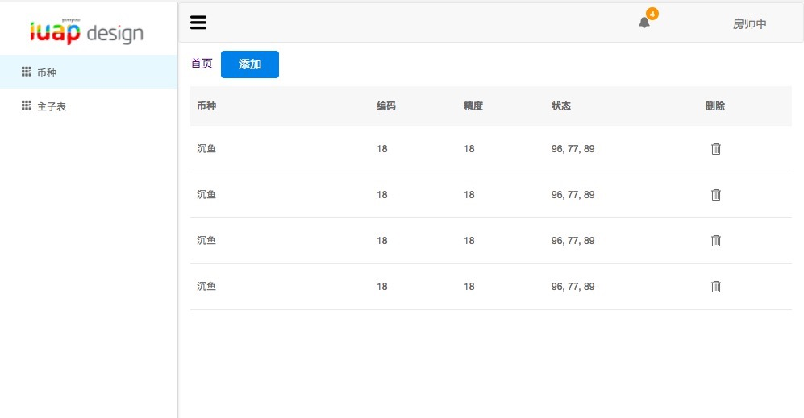
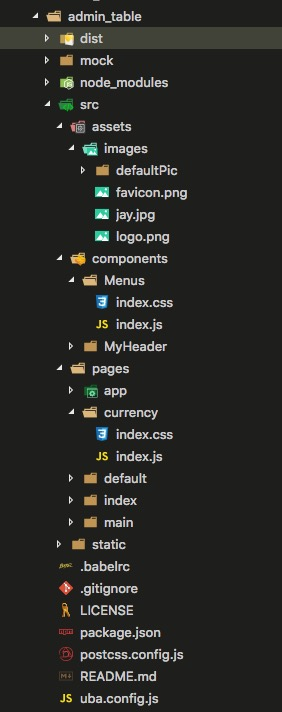

# 基于Tinper-bee中的table组件和其他组件 来实现币种表案例

### 目录结构

1、上一章我们讲解了使用uba来搭建一个项目，正如大家所看到的 使用uba 搭建一个项目是如此简单，搭建出项目环境只是我们项目的第一步，这一章我们来讲一下利用tinper-bee组件来实现一个currencv table （币种表），通过这个表我们能够初步了解 利用React、es6 编写项目配合tinper-bee组件迅速实现美观大方的页面是非常愉快的一件事。什么是tinper-bee呢？简单说一下 [tinper-bee](http://bee.tinper.org/) tinper-bee 是基于 iuap design 的 react 组件库，包含丰富的基础组件和应用组件，支持组件的灵活调用和扩展，助力快速进行应用的组件化开发。React 是一个采用声明式，高效而且灵活的用来构建用户界面的框架。[react开发中文版教程网址](https://doc.react-china.org/tutorial/tutorial.html)  

#### 丰富的基础组件

包含大量简单易用的基础组件，支持快速搭建页面和构建您的个人应用。

#### 企业级特性组件

提供适用于企业级应用的表单，表格和grid组件，满足您大量数据处理操作展示和复杂交互需求。

#### 支持强大的组件扩展和自定义

每个组件提供了丰富的API接口和充分自由度给用户来定义自己的组件，实现用户想要的效果和特性。

上面tinper-bee网址中有更多更详细的tinder-bee的介绍，在此我们不做过多的介绍，开始来说一下我们构建币种项目的目录结构；

2、首先看一下项目实现效果：



币种表单简单的实现了数据展示，数据编辑，数据添加，数据删除功能。



3、如图所示，assets文件存📂放 images文件夹📂，components文件夹📂存放公用组件，pages 文件夹📂存放页面文件，pages分为 app、currency、default、index文件夹；

### 文件讲解

1、首先我们从index文件夹开始说起，正如大家所了解的，这个项目为多页项目，所以我们这个项目分为多个页面，每个页面分为一个文件夹📂，方便管理的规则，目录清晰。index文件夹内分文，index.js,index.css,index.html;此处在uba.donfig.js内配置，页面入口。

```
//dev多入口配置
glob.sync("./src/pages/*/index.js").forEach(path => {
  const chunk = path.split("./src/pages/")[1].split("/index.js")[0];
  entries[chunk] = [path, hotMiddlewareScript];
  chunks.push(chunk);
});
```

2、我们首先看 index文件夹中的index.html

```
<!DOCTYPE html>
<html lang="zh-CN">
<head>
  <meta charset="UTF-8">
  <meta name="viewport" content="width=device-width, initial-scale=1.0">
  <meta http-equiv="X-UA-Compatible" content="ie=edge">
  <title>Index</title>
    <link rel="stylesheet" href="//design.yonyoucloud.com/static/tinper-bee/0.6.2/assets/tinper-bee.min.css">
</head>
<body>
  <div id="app"></div>
  <script src="//design.yonyoucloud.com/static/babel-polyfill/6.26.0/polyfill.min.js"></script>
  <script src="//design.yonyoucloud.com/static/react/15.6.1/react.min.js"></script>
  <script src="//design.yonyoucloud.com/static/react/15.6.1/react-dom.min.js"></script>
   <script src="//design.yonyoucloud.com/static/tinper-bee/0.6.2/build/tinper-bee.js"></script>
</body>
</html>
```

通过上面的代码可以看出，首先我们引入了tinper-bee.min.css 地址为线上地址，此处较大的文件 引入线上地址来减少打包后的项目体积。此处script 引入了，polyfill.min.js 处理IE低版本浏览器不兼容问题，和react核心代码react.min.js 和react-dom.min.js 和我们组件库核心代码 tinper-bee.js;很显眼的一个div id=‘app’的元素用于存放我们逻辑处理后的元素。相当于一个容器便于页面切换和元素变换。


3、我们又看一下index文件夹中的index.js

```
//引入react核心代码定义变量为React；
import React from 'react';
//引入react 渲染代码 定义为ReactDOM;
import ReactDOM from 'react-dom';
//引入项目的核心代码 路由入口代码；
import App from '../app/index'
//引入 mirrorx 阿里封装的redux代码；
import mirror, { Router, Route, render ,hashHistory} from 'mirrorx';
//引入 css文件；来修饰 页面元素样式；
import './index.css';
//此处获取页面app元素，来存放我们页面的输出页面；
const content = document.querySelector("#app");
//此处定义 mirror的配置路由模式为hash；
mirror.defaults({
    historyMode: 'hash'
});
//使用mirrorx中的render方法来渲染页面。
render(<Router><App /></Router>, content);
```

通过上面代码来看index.js是核心代码，引入需要的代码，渲染页面。

4、我们再看一下index.css ，或者index.less;

```
.Test{
  color : "green";
  background: url("../../assets/images/jay.jpg") no-repeat center center;
}
.uf{
  font-size: 16px;
}
.u-breadcrumb{
  margin: 0;
  margin-bottom: 20px;
}
```

此处代码就是定义元素的显示方式，以及背景图片，字体大小等。

5、app文件夹代码解析。

app文件夹📂中的index.js

```
//引入react核心代码；
import React, { Component } from 'react';
//引入mirrorx中的路由；
import { Router, Route } from 'mirrorx';
//引入classnames 来处理 元素样式的逻辑判断。下面会单独说classnames的用法。
import classnames from 'classnames';
//重点来了，此处引入 tinper-bee的组件 Icon和Con两个组件。
import { Icon, Con } from 'tinper-bee';
// 引入组件来实现路由切换;
import Def from '../default/index';
import Main from '../main/index';
import AddList from '../currency/index';
import Menus from 'components/Menus/index';
import MyHeader from 'components/MyHeader/index';
//引入样式;
import './index.css';
//定义 App组件
export default class App extends Component {
    constructor(props) {
    //此处是props集成字Component
        super(props);
        //该组件的状态，通过状态来控制页面逻辑、数据等。
        this.state = {
            toggle: false
        }
    }
    // 展开收起菜单(定义事件操作元素)
    handleToggle = () => {
        this.setState({
            toggle: !this.state.toggle
        })
    }
    //页面渲染
    render() {
    //定义变量 使用es6结构方法获取变量，此处有ES6的语法讲解的详情文档就会一目了然。
        const { toggle } = this.state;
        return (
        	//此处为 元素行内样式写法，但不建议如此写法，最好用className来修饰元素，页面不会乱，方便管理；
            <div style={{ height: '100%' }}>
            	//react 的class写法是className 为了避免 定义class的语法冲突，所以css 的class必须使用className来修饰元素，classnamse组件来实现样式逻辑。
                <div className={classnames("side-bar", { "toggled": toggle })}>
                	//下面代码为是根据toggle的状态来控制 显示Icon图标还是img图片标签；
                    {
                        toggle ? (
                            <Icon type="uf-iuap-col" className="nav-icon" />
                        ) : ()
                    }
                    //此处引入公用Menus组件；
                    <Menus toggle={toggle} />
                </div>
                <div className={classnames("content", { "toggled": toggle })}>
                    <MyHeader toggle={toggle} onToggle={this.handleToggle} />
                    <Con fluid={true}>
                        <Route exact path="/" component={Def} />
                        <Route path="/AddList" component={AddList} />
                        <Route path="/Mains" component={Main} />
                    </Con>
                </div>
            </div>
        )
    }
}
```

上面代码有点多，我们一步一步解析，另外也可以参考代码内注释，方便理解。代码分为两部分，上半部分为引入部分，来引用我们公用的组件公用的库，公用的样式等文件，此处不做过多的解释，下半部分为定义默认组件并且输出去。

```
export default class App extends Component //定义并输出组件，export 输出 defualt 默认 class 组件 为App名字的组件。
```

此处代码是定义组件继承和定义状态

```
 constructor(props) {
    //此处是props集成字Component
        super(props);
        //该组件的状态，通过状态来控制页面逻辑、数据等。
        this.state = {
            toggle: false
        }
    }
```

此处代码是定义事件方法并且修改组件状态来达到与页面互动的效果

```
 // 展开收起菜单(定义事件操作元素)
    handleToggle = () => {
    	//在组件内this 代表组件本身，this.state 可以直接获取组件状态  this.setState 方法来改变 组件的state状态。
        this.setState({
            toggle: !this.state.toggle
        })
    }
```

render方法的使用

```
 //页面渲染
    render() {
    //定义变量 使用es6结构方法获取变量，此处有ES6的语法讲解的详情文档就会一目了然。
        const { toggle } = this.state;
        return出去在react 16版本之前只允许 输出一个元素就是顶级元素多了就会报错，16版本之后就可以return 数组如：return [
         	<div>222</div>,
        	<div>222</div>,
    	]；
    	可以return 字符串 如： return '我是一个静态字符串，我负责渲染名字'等。
        return (<div>我是输出的元素</div>)
        }
```

6、下面我们介绍币种组件代码；currency组件；

先看index.js 代码

```
/**引入核心代码 css样式**/
import React, { Component } from 'react';
import { Link } from 'mirrorx';
import { Row, Col, Panel, Table, Select, Button, Modal, Form, FormControl, FormGroup, InputGroup, Icon, Input, Popconfirm, Animate, ControlLabel } from 'tinper-bee';
import './index.css';
```

定义组件

```
class AddList extends Component 
```

定义组件状态 以及表格所用数据；因为是前端代码，目前数据模拟为本地数据，后续会单独说对接后台请求数据；

```
constructor(props) {
        super(props);
        // 定义表格表头
        this.columns = [
            { title: "币种", dataIndex: "name", key: "name", width: "30%" },
            { title: "编码", dataIndex: "code", key: "code" },
            { title: "精度", dataIndex: "currdigit", key: "currdigit" },
            { title: "状态", dataIndex: "enablestatus", key: "enablestatus" },
            {
                title: "删除", dataIndex: "operation", key: "operation",
                render: (text, record, index) => {
                    return (
                        <Popconfirm content="确认删除?" id="aa" onClose={this.onDelete(index)}>
                            <Icon type="uf-del" />
                        </Popconfirm>
                    );
                }
            }
        ];
        this.state = {
            dataSource: [
                { key: "0", name: "沉鱼", code: "1", currdigit: "18", pk_currtype: false, enablestatus: "96, 77, 89", },
                { key: "1", name: "落雁", code: "2", currdigit: "18", pk_currtype: false, enablestatus: "96, 77, 89", },
                { key: "2", name: "闭月", code: "3", currdigit: "18", pk_currtype: false, enablestatus: "96, 77, 89", },
                { key: "3", name: "羞花", code: "4", currdigit: "18", pk_currtype: false, enablestatus: "96, 77, 89", },
            ],
            count: 1,
            showModal: false,
            refCbData: [],
            addOrChange: false,
            changeIndex: '',
            name: "",
            code: "",
            currdigit: "",
            enablestatus: "1",
            pk_currtype: false,
            dataLink: [],

        };
        self = this;
    }
```

初始化数据此处有一个生疏的单词就是 componentDidMount方法，这就涉及到[react 组件的生命周期](http://www.runoob.com/react/react-component-life-cycle.html) ，生命周期包括：

当组件在**客户端**被实例化，第一次被创建时，以下方法依次被调用：

1、getDefaultProps
2、getInitialState
3、componentWillMount
4、render
5、componentDidMount

当组件在**服务端**被实例化，首次被创建时，以下方法依次被调用：

1、getDefaultProps
2、getInitialState
3、componentWillMount
4、render

```
componentDidMount() {
        this.initData();
    }
    // 初始化数据
    initData = () => {
        // axios({
        //     method: 'get',
        //     // http://10.11.65.50:9999/appdemo/train_currtype/list
        //     // https://api.douban.com/v2/book/search?q=javascript&count=1
        //     url: 'http://api.douban.com/v2/book/search?q=javascript&count=1    ',
        // }).then(function (res) {
        //     console.log(res);
        // });

    }
```

代码中间部分为组件的方法部分即是逻辑处理部分

```
 //点击行执行方法
 onCellChange = (index, key) => {
        return value => {
            const dataSource = [...this.state.dataSource];
            dataSource[index][key] = value;
            this.setState({ dataSource });
        };
    };
    // 删除数据执行方法
    onDelete = (index) => {
        return () => {
            const dataSource = [...this.state.dataSource];
            dataSource.splice(index, 1);
            this.setState({ dataSource });
        };
    };
    ...
```

最后即是渲染页面 并输出组件

```
 // 渲染页面
    render() {
        const { dataSource, addOrChange, dataLink } = this.state;
        const columns = this.columns;
        var data = this.state, tac = { 'text-align': 'right' }, mt = { 'margin-top': '10px' }, lmt = { 'margin-top': '18px' }
        return (
            <div>
                <Link to="/">首页</Link>
                 <Link to="/">首页</Link>
                <Modal
                    show={this.state.showModal}
                    onHide={this.close} >
                    <Modal.Header>
                        <Modal.Title>{addOrChange ? '修改' : '添加'}币种信息：</Modal.Title>
                    </Modal.Header>
                    <Row>
                        <Modal.Body ref={(c) => { this.FormData = c }} style={tac} >
                            <Col md={2} xs={2} sm={2} style={lmt}>币种：</Col>
                            <Col md={4} xs={4} sm={4} ><FormControl type="text" onChange={this.valueChange.bind(this, 'name')} value={data.name} style={mt} />
                            </Col>
                            <Col md={2} xs={2} sm={2} style={lmt}>编码：</Col>
                            <Col md={4} xs={4} sm={4} ><FormControl type="text" onChange={this.valueChange.bind(this, 'code')} value={data.code} style={mt} /> </Col>
                            <Col md={2} xs={2} sm={2} style={lmt}>精度：</Col>
                            <Col md={4} xs={4} sm={4} ><FormControl type="text" onChange={this.valueChange.bind(this, 'currdigit')} value={data.currdigit} style={mt} /></Col>

                        </Modal.Body>
                    </Row>
                    <Modal.Footer>
                        <Button onClick={this.close} shape="border" style={{ marginRight: 50 }}>关闭</Button>
                        <Button onClick={this.addMoreList} colors="primary">{addOrChange ? '修改' : '确认'}</Button>
                    </Modal.Footer>
                </Modal>
                <Button
                    className="editable-add-btn"
                    colors="primary"
                    className="a"
                    onClick={this.handleAdd}
                >
                    添加
                </Button>
                <Table
                    bordered
                    data={dataSource}
                    columns={columns}
                    getBodyWrapper={this.getBodyWrapper}
                    onRowClick={this.rowClick}
                />
            </div>)
         }
 //输出组件方便调用
 export default AddList;
```

#### 最后总结

以上代码就是一个简单的币种表格实现方式，由于涉及配置部分请根据项目不同自行配置。